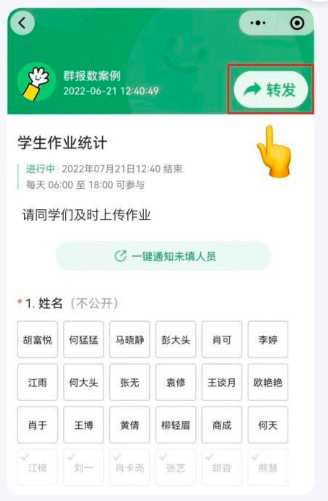
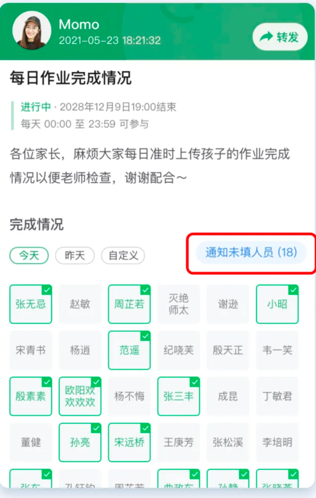

# 一款学生作业提交平台

id:班级 {
    s:{},
    t:{
      subject:{
          [name:’‘，teacher:'',work:{}],
          [name:’‘，teacher:''],
      }   
    }
}

## 学生作业统计 p3
  
  
## 学生作业详情 p0
  搜索框、我参与的、别人的提交
## 学生作业提交 p1 
  浮动按钮、详情页按钮（点击提交）
## 学生作业下载 p4
  学委选择班级、学科、某项作业三类来筛选
  选择下载